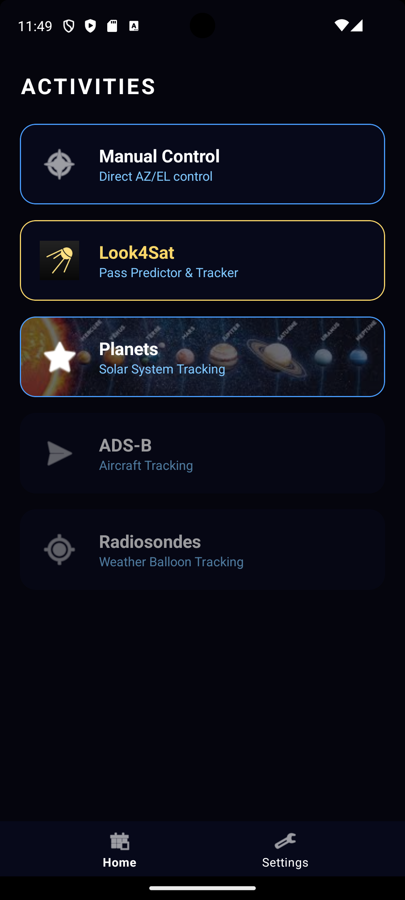
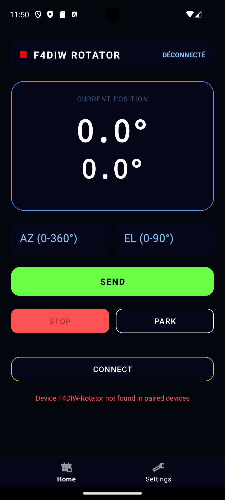
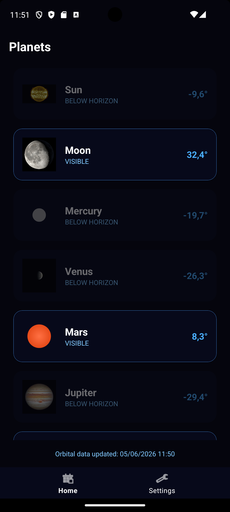
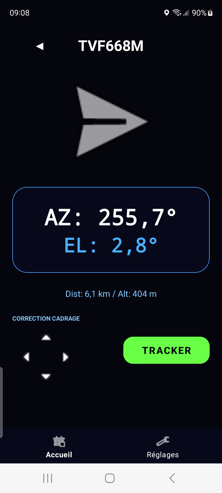
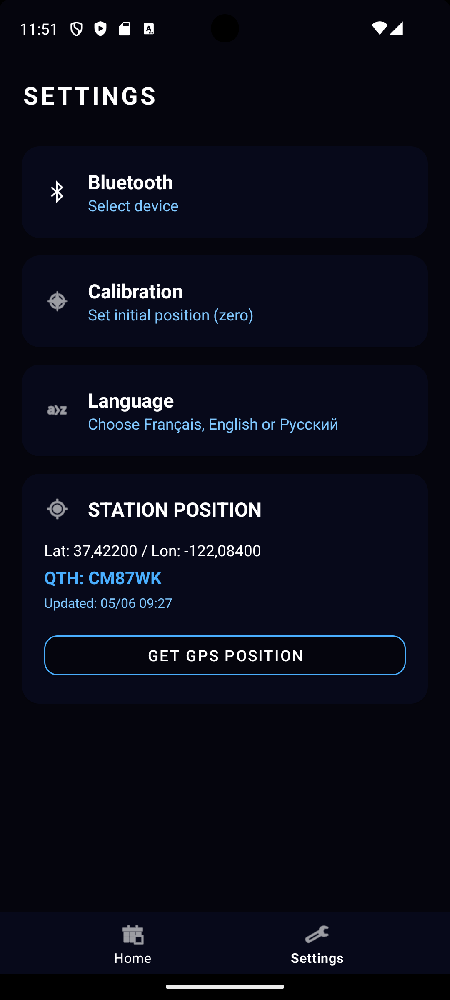

# F4DIW Rotator App 📡🛰️

(English version below / Version française plus bas)

---

# English Version

Modern Android application for controlling the **F4DIW** satellite antenna rotator. This application communicates via Bluetooth Classic (SPP) with an ESP32-based firmware (Wemos D1 R32) and supports Look4Sat and EasyComm II protocols.

## 🚀 Key Features

- **High-Tech Interface**: Dark design inspired by Look4Sat with a "Radar" rendering and monospace typography for coordinates.
- **Activity Hub**: Quick access to manual control, planetary tracking, and direct launch of Look4Sat.
- **Premium Splash Screen**: Full-screen startup (4s) with integrated logo and radar.
- **Real-Time Control**: Large AZ/EL display with automatic updates.
- **Planetary Tracking**: Real-time calculation (via Astronomy Engine) of Sun, Moon, and all solar system planets (including Mercury and Uranus) with NASA visuals.
- **Data Sources Management**: Configuration of ADS-B and Radiosondes server URLs to prepare for upcoming tracking features.
- **Alignment Correction**: Integrated mini-joystick in the tracking screen for fine-tuning the antenna alignment (+/- 0.5° per click) without affecting the displayed astronomical coordinates.
- **Position Management**: Phone GPS position retrieval and automatic **QTH Locator (Maidenhead)** calculation.
- **Jog & Reset Calibration System**: 
  - Manual movement via directional pad (Jog) of +/- 1.0° in settings.
  - **Software Azimuth Offset**: Ability to shift the "dead zone" (the 0-360 stop) by adding a software offset (e.g., 180° to move the mechanical stop to the South), allowing continuous tracking across the North.
  - Software reset (`RST` command) to define the reference point.
- **Multilingual**: Full support for **French**, **English**, and **Russian**.
- **Robust Bluetooth**: Secure ESP32 connection management, dynamic device selection in settings.

## 📸 Overviews

<p align="center">
  
  
  
  
  
</p>

- **Home**: Central hub with different activities.
- **Control**: Manual pilot interface with position feedback.
- **Planets**: List of celestial bodies with real NASA visuals.
- **ADS-B**: Real-time aircraft tracking with photos.
- **Settings**: Bluetooth, Language, and GPS Position configuration.

## 📱 Installation

The application is automatically compiled with every GitHub update.
1. Go to the **Actions** tab of this repository.
2. Select the latest successful build (**Android Release Build**).
3. Download the artifact named `F4DIW-rotator.apk`.

## ⚙️ Firmware Configuration (ESP32)

For full compatibility with calibration and jog functions, ensure your firmware handles the following commands in the main loop:

```cpp
if (SerialBT.available()) {
    String cmd = SerialBT.readStringUntil('\n');
    cmd.trim();
    if (cmd.startsWith("ML")) control_az.setpoint -= 1.0;
    if (cmd.startsWith("MR")) control_az.setpoint += 1.0;
    if (cmd.startsWith("MU")) control_el.setpoint += 1.0;
    if (cmd.startsWith("MD")) control_el.setpoint -= 1.0;
    if (cmd.startsWith("RST")) {
        stepper_az.setCurrentPosition(0);
        stepper_el.setCurrentPosition(0);
        control_az.setpoint = 0;
        control_el.setpoint = 0;
        SerialBT.println("AZ000.0 EL00.0");
    }
}
```

## 🙏 Acknowledgments and Data Sources

This project uses and thanks the following sources:
- **NASA Scientific Visualization Studio (SVS)**: For high-resolution planetary visuals.
- **Astronomy Engine (Don Cross)**: For the high-precision astronomical calculation library.
- **Look4Sat (Arty Bishop)**: For visual inspiration and the excellent satellite prediction app.
- **SatNOGS**: For rotator protocol standards.

## 🛠️ Technical Stack

- **Language**: Kotlin
- **UI**: Material Design 3, ViewBinding, Fragments
- **Architecture**: MVVM (ViewModel, Repository, StateFlow)
- **CI/CD**: GitHub Actions (Automatic Build & Release)

---

# Version Française

Application Android moderne pour le contrôle du rotateur d'antenne satellite **F4DIW**. Cette application communique via Bluetooth Classic (SPP) avec un firmware basé sur ESP32 (Wemos D1 R32) et supporte les protocoles Look4Sat et EasyComm II.

## 🚀 Caractéristiques principales

- **Interface High-Tech** : Design sombre inspiré de Look4Sat avec un rendu "Radar" et une typographie monospace pour les coordonnées.
- **Hub d'activités** : Accès rapide au contrôle manuel, au tracking planétaire, et lancement direct de Look4Sat.
- **Splash Screen Premium** : Écran de démarrage plein écran (4s) avec logo et radar intégrés.
- **Contrôle Temps Réel** : Affichage AZ/EL en gros caractères avec mise à jour automatique.
- **Tracking Planétaire** : Calcul en temps réel (via Astronomy Engine) de la position du Soleil, de la Lune et de toutes les planètes du système solaire (Mercure et Uranus incluses) avec visuels NASA.
- **Gestion des Sources de Données** : Configuration des URLs des serveurs ADS-B et Radiosondes pour préparer les futures fonctionnalités de tracking.
- **Correction de Cadrage** : Mini-joystick intégré à l'écran de tracking pour affiner l'alignement de l'antenne (+/- 0.5° par clic) sans modifier les coordonnées astronomiques affichées.
- **Gestion de Position** : Récupération de la position GPS du téléphone et calcul automatique du **QTH Locator (Maidenhead)**.
- **Système de Calibration Jog & Reset** : 
  - Déplacement manuel par pavé directionnel (Jog) de +/- 1.0° dans les réglages.
  - **Offset d'Azimut Logiciel** : Possibilité de décaler la "zone morte" (la butée 0-360) en ajoutant un décalage logiciel (ex: 180° pour déplacer la butée mécanique au Sud), permettant un suivi continu lors du passage au Nord.
  - Remise à zéro logicielle (commande `RST`) pour définir le point de référence.
- **Multilingue** : Support complet du **Français**, de l'**Anglais** et du **Russe**.
- **Bluetooth Robuste** : Gestion sécurisée des connexions ESP32, sélection dynamique du périphérique dans les réglages.

## 📸 Aperçus

<p align="center">
  
  
  
  
  
</p>

- **Accueil** : Hub central avec les différentes activités.
- **Contrôle** : Interface de pilotage manuel avec retour de position.
- **Planètes** : Liste des astres avec visuels réels de la NASA.
- **ADS-B** : Suivi des avions en temps réel avec photos.
- **Réglages** : Configuration Bluetooth, Langue et Position GPS.

## 📱 Installation

L'application est automatiquement compilée à chaque mise à jour sur GitHub.
1. Allez dans l'onglet **Actions** de ce dépôt.
2. Sélectionnez le dernier build réussi (**Android Release Build**).
3. Téléchargez l'artefact nommé `F4DIW-rotator.apk`.

## ⚙️ Configuration du Firmware (ESP32)

Pour une compatibilité totale avec les fonctions de calibration et de jog, assurez-vous que votre firmware gère les commandes suivantes :

```cpp
if (SerialBT.available()) {
    String cmd = SerialBT.readStringUntil('\n');
    cmd.trim();
    if (cmd.startsWith("ML")) control_az.setpoint -= 1.0;
    if (cmd.startsWith("MR")) control_az.setpoint += 1.0;
    if (cmd.startsWith("MU")) control_el.setpoint += 1.0;
    if (cmd.startsWith("MD")) control_el.setpoint -= 1.0;
    if (cmd.startsWith("RST")) {
        stepper_az.setCurrentPosition(0);
        stepper_el.setCurrentPosition(0);
        control_az.setpoint = 0;
        control_el.setpoint = 0;
        SerialBT.println("AZ000.0 EL00.0");
    }
}
```

## 🙏 Remerciements et Sources de données

Ce projet utilise et remercie les sources suivantes :
- **NASA Scientific Visualization Studio (SVS)** : Pour les visuels planétaires haute résolution.
- **Astronomy Engine (Don Cross)** : Pour la bibliothèque de calculs astronomiques de haute précision.
- **Look4Sat (Arty Bishop)** : Pour l'inspiration visuelle et l'excellente application de prédiction satellite.
- **SatNOGS** : Pour les standards de protocole rotateur.

## 🛠️ Stack Technique

- **Langage** : Kotlin
- **UI** : Material Design 3, ViewBinding, Fragments
- **Architecture** : MVVM (ViewModel, Repository, StateFlow)
- **CI/CD** : GitHub Actions (Build & Release automatique)

---
*F4DIW · Satellite Antenna Control · ESP32 · Android Studio*
